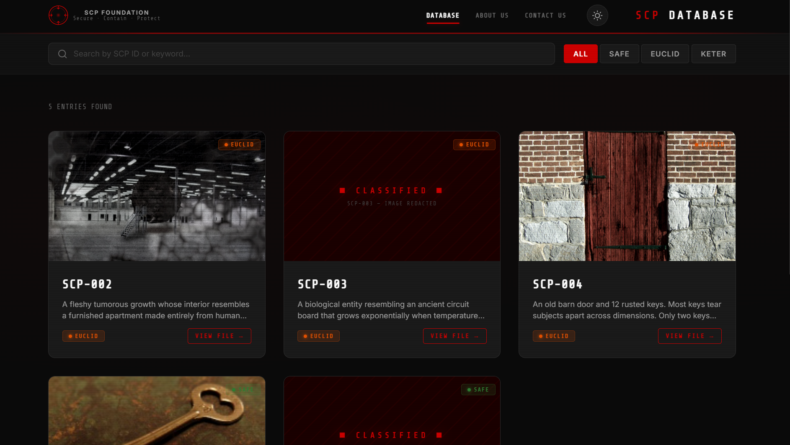
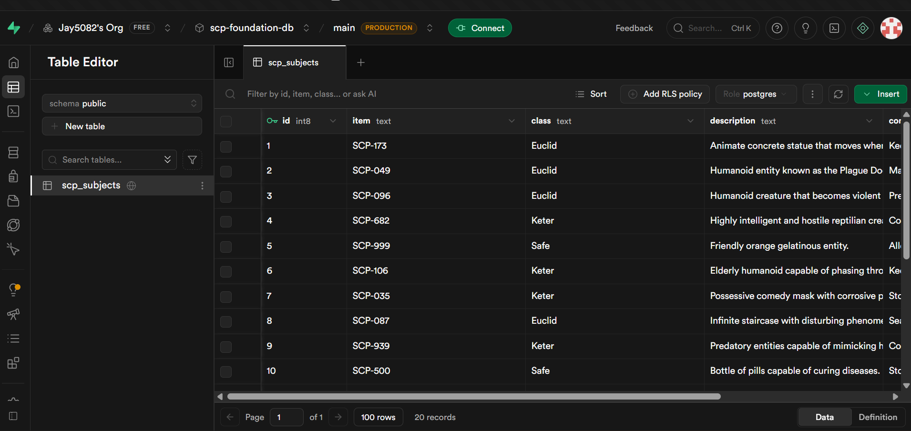
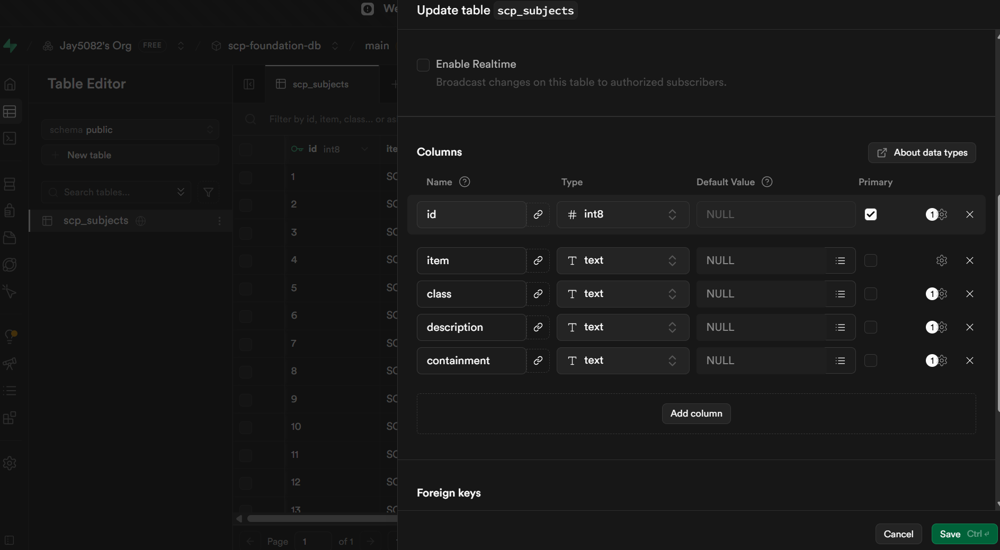
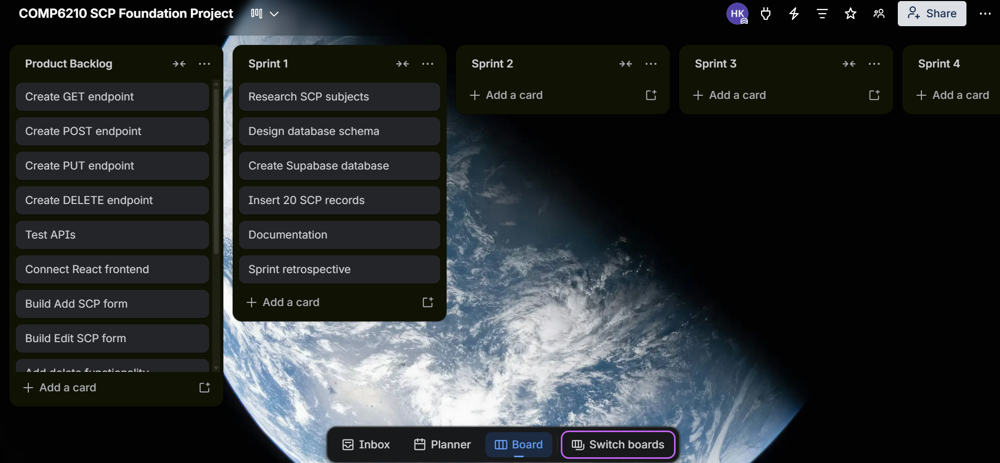
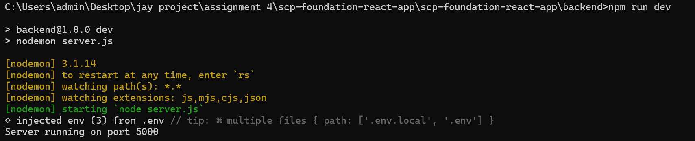
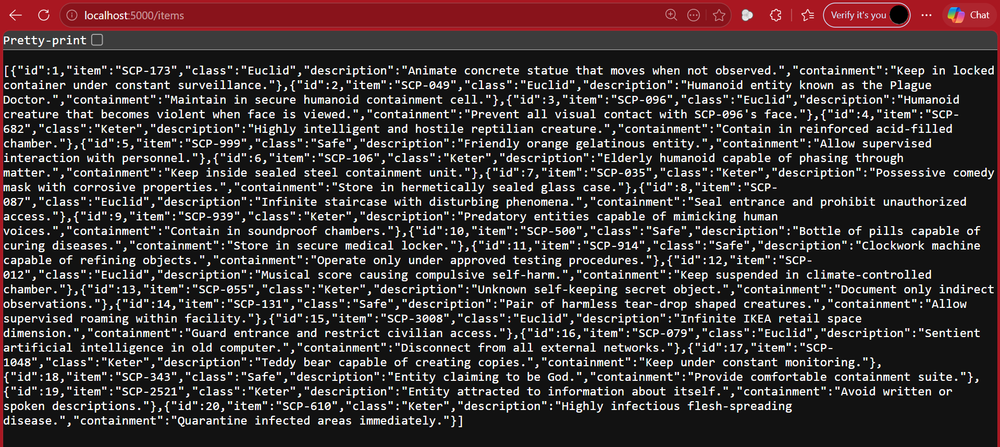

## Student Information

Name: Jay gajera  
Student ID: 30084872
Course: COMP.6210 Web Services & Design Methodologies  
Semester: Semester 1 2026

# SCP Foundation Database

A premium, cinematic single-page application for browsing SCP Foundation entries. Built with React + Vite.


## Features

- 🔍 **Search** — Filter entries by SCP ID, description, or containment procedures
- 🏷️ **Classification Filters** — Toggle between All, Safe, Euclid, and Keter
- 📋 **Detail Modal** — Click any card to view full SCP documentation
- 🎨 **Dark Cinematic Theme** — Professional SCP Foundation aesthetic
- 📱 **Fully Responsive** — 3-column → 2-column → 1-column grid
- ♿ **Accessible** — ARIA labels, keyboard navigation, focus management
- ⚡ **Smooth Animations** — Card hover effects, modal transitions, staggered load

## Tech Stack

| Technology | Purpose |
|------------|---------|
| React 19   | UI Framework |
| Vite 6     | Build Tool & Dev Server |
| Vanilla CSS | Styling (CSS Custom Properties) |
| Inter + Share Tech Mono | Typography (Google Fonts) |

## Getting Started

### Prerequisites

- **Node.js** v18 or later
- **npm** v9 or later

### Run Locally

```bash
# 1. Clone or download the project
cd scp-foundation

# 2. Install dependencies
npm install

# 3. Start development server
npm run dev
```

The app will be available at `http://localhost:5173`

### Build for Production

```bash
npm run build
```

The optimized output will be in the `dist/` folder.

### Preview Production Build

```bash
npm run preview
```

## Deploy on Netlify

### Option A: Drag & Drop (Easiest)

1. Run `npm run build`
2. Go to [Netlify Drop](https://app.netlify.com/drop)
3. Drag and drop the `dist/` folder
4. Your site is live! 🎉

### Option B: Connect Git Repository

1. Push this project to GitHub
2. Go to [Netlify](https://app.netlify.com) → "New Site from Git"
3. Select your repository
4. Set build command: `npm run build`
5. Set publish directory: `dist`
6. Click "Deploy Site"

## Project Structure

```txt
scp-foundation/
│
├── backend/
│   ├── node_modules/
│   ├── .env
│   ├── package.json
│   ├── package-lock.json
│   └── server.js
│
├── documentation/
│   ├── product-backlog.md
│   ├── sprint1-standup.md
│   ├── sprint1-retrospective.md
│   └── sprint2-standup.md
│
├── screenshots/
│   ├── react-ui.png
│   ├── scp-records.png
│   ├── supabase-table.png
│   ├── trello-board.png
│   ├── api-get-test.png
│   └── backend-server-running.png
│
├── public/
│   └── images/
│
├── src/
│   ├── components/
│   │   ├── Navbar.jsx
│   │   ├── SearchFilter.jsx
│   │   ├── SCPCard.jsx
│   │   ├── SCPList.jsx
│   │   └── SCPDetail.jsx
│   │
│   ├── data/
│   │   └── scpData.json (temporary local data)
│   │
│   ├── App.jsx
│   ├── index.css
│   └── main.jsx
│
├── index.html
├── vite.config.js
├── package.json
└── README.md
```

## Adding SCP Images

Place images in the `public/images/` folder. The `image` field in `scpData.json` should be a relative path like `images/SCP-005.jpg`.

If an image is missing or fails to load, a styled "CLASSIFIED" placeholder is shown automatically.

## License

This project is for educational purposes only. SCP Foundation content is licensed under CC-BY-SA 3.0.

---

# COMP6210 Assignment Information

This project is developed for:

- COMP.6210 — Web Services & Design Methodologies
- Assignment 2 — React UI / Cloud Backend Project
- Assignment 3 — Agile Scrum SDLC Methodology

The project follows Agile Scrum methodology across multiple sprints including:

- Planning
- Database setup
- REST API development
- React frontend integration
- Testing and deployment

---

# Sprint Progress

## Sprint 1 — Planning & Database Setup
### Completed
- GitHub repository created
- React + Vite project structure completed
- SCP Foundation UI designed
- Trello Scrum board setup
- Product backlog created
- Supabase cloud database configured
- SCP database schema designed
- 20 SCP subjects inserted into cloud database
- Sprint documentation prepared

### Current Focus
- Preparing REST API integration for CRUD operations

---

## Sprint 2 — REST API Development

### Completed
- Backend Express server initialized
- Supabase connected to backend
- GET /items endpoint created
- JSON API successfully returning SCP records
- Environment variables configured
- GET REST API successfully tested with live cloud database


### In Progress
- Create POST endpoint
- Create PUT endpoint
- Create DELETE endpoint
- API testing with Postman

# REST API

## Current Endpoint

```txt
GET http://localhost:5000/items
```

Returns all SCP records from the Supabase cloud database in JSON format.

---

## Sprint 3 — React CRUD Integration
### Planned
- Connect React frontend to REST API
- Build Add SCP form
- Build Edit SCP form
- Add delete functionality
- Improve UI responsiveness

---

## Sprint 4 — Testing & Deployment
### Planned
- Full CRUD testing
- Deploy frontend to Netlify
- Deploy backend API
- Final documentation and screenshots

---

# Cloud Technologies

| Service | Purpose |
|---|---|
| Supabase | Cloud PostgreSQL Database |
| React | Frontend UI |
| Vite | Development & Build Tool |
| Netlify | Frontend Deployment |
| Express.js | Backend REST API |
| Node.js | Backend Runtime |
| Render | Backend Deployment |
| GitHub | Version Control |
| Trello | Agile Scrum Project Management |

---

# Agile Scrum Board

Trello Board URL:

```txt
https://trello.com/invite/b/6a0b0352f66d672bee57e547/ATTI8143da0907ce5a81de843721babc4bedFA39D9EE/comp6210-scp-foundation-project
```

---

# Screenshots

## React UI



## Supabase Database Records



## Supabase Table Structure



## Trello Scrum Board



## Backend API Test



## Backend Server Running



---

# Future Improvements

- Authentication system
- SCP image uploads
- Pagination and advanced filtering
- User roles and permissions
- REST API security improvements
- Better mobile responsiveness

---